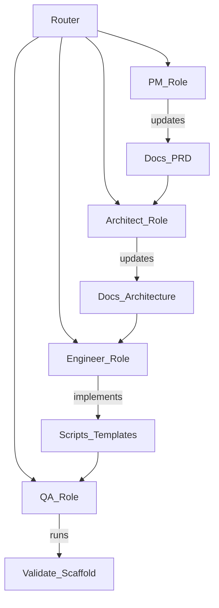

# Operating model (repo-only) — Roles, Skills, Handoffs

This document specifies how to run AgentOS as a **multi-role system** without requiring any Cursor-specific automation. It is intentionally **repo-only**: just files, conventions, and repeatable skills.

## Principles
- **Roles own outcomes**: each role has clear inputs/outputs and boundaries.
- **Skills are the execution unit**: skills make actions repeatable and auditable.
- **Docs are the contract**: avoid drift by keeping docs aligned to implementation.

## Role → Skill mapping (v1)

| Role | Primary responsibility | Skills to use |
| --- | --- | --- |
| PM | Scope + success criteria | `skills/add-placeholder` (when metadata needed), (future) PRD/Roadmap editing skills |
| Architect | Boundaries + contracts | `skills/add-preset` (when adding a preset), `skills/add-placeholder` |
| Engineer | Implementation of CLI + templates | `skills/add-preset`, `skills/add-role`, `skills/add-placeholder` |
| QA | Validation + reproducibility | `skills/validate-scaffold-output`, `skills/create-test-fixture` |

## Handoff protocol (minimal)

Handoffs are done by updating **explicit files**:
- PM → Architect:
  - AgentOS repo scope: `docs/internal/PRD_AgentOS.md`
  - Generated project scope: `docs/PRD.md` (+ `docs/Roadmap.md` as needed)
- Architect → Engineer: `docs/Architecture.md` / contract sections
- Engineer → QA: `docs/QA-Plan.md` checklist + a runnable validation command

For AgentOS development (this repo), the SSOT is `docs/internal/PRD_AgentOS.md`. For generated projects, SSOT lives in the generated repo’s `docs/` (see `docs/agent-os/03_repo-architecture.md`).

## Recommended orchestration flow (future subagents)

## “Definition of Done” checkpoints (v1)
- **Scaffold works**: `node scripts/new-project.js ...` produces expected tree.
- **Validation passes**: `node scripts/validate-scaffold.js <path>` returns success.
- **No drift**: generated files are non-empty and contain no unresolved placeholders.

